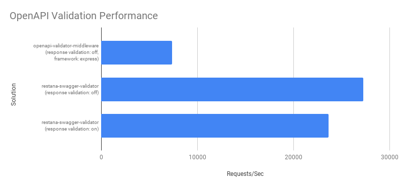

# restana-swagger-validator
Validating REST APIs using OpenAPI (formerly known as Swagger) specifications is crucial to ensure that the API complies with the standard set by the specification. OpenAPI validation helps in maintaining a consistent design, improving API usability, and providing a way for developers to quickly and easily understand the functionality and expected inputs and outputs of an API.  

However, API validators are required to be fast, particularly in the context of REST APIs, where response time is a critical performance factor. A validation process that adds significant overhead can cause the API to become slow and unresponsive, resulting in a poor user experience for clients.

The `restana-swagger-validator` module provides a validation layer that is specifically designed for use with the restana framework. This validation layer is optimized for high performance, ensuring that the validation process does not significantly impact the overall performance of the API:



## Main features
- OpenAPI/Swagger [v2](https://swagger.io/specification/v2/) and [v3](https://swagger.io/specification/) spec supported through the `api-schema-builder` module
- Fast validator middlewares based on restana `app.events.BEFORE_ROUTE_REGISTER` event hook
- Low-level validator is based on https://www.npmjs.com/package/ajv 

Module interface: 
```js
SwaggerValidator(app: restana, spec: string | Object, config: Object)
```
Please note that when using the `SwaggerValidator` function with the `spec` argument as a string, the function will use `require(spec)` to lookup the Swagger specification file.  
It's important to note that only JSON format is currently supported for the Swagger specification file. If you have a YAML specification file, you will need to convert it to JSON before passing it to the `SwaggerValidator` function.

> To convert a YAML file to JSON, you can use a YAML to JSON converter tool, such as the `js-yaml` and `JSON.stringify()` methods in JavaScript, or online YAML to JSON converter services. Once your YAML file is converted to JSON, you can pass it to the `SwaggerValidator` function.


## Configuration options
- `buildResponses`: If TRUE, response validation schemas will be parsed and cached for use. Default value: `TRUE`
- `requireSchemaSpec`: If TRUE, an existing schema specification will be required when registering route endpoints. Default value: `TRUE`
- `apiSpecEndpoint`: Server endpoint to expose the Swagger specification. Default value: `/swagger.json`
- `uiEndpoint`: Server endpoint to expose the Swagger documentation UI. Default value: `/docs`
- `publicApiEndpoint`: Public HTTP server endpoint. Default value: `http://localhost:3000`

## Usage
```js
const restana = require('restana')
const bodyParser = require('body-parser')
const path = require('path')

const {
  SwaggerValidationError,
  SwaggerValidator
} = require('restana-swagger-validator')

const app = restana({
  errorHandler: (err, req, res) => {
    if (err instanceof SwaggerValidationError) {
      res.statusCode = err.statusCode
      res.send({
        message: err.message,
        errors: err.errors
      })
    } else {
      res.send(err)
    }
  }
})

SwaggerValidator(app, path.join(__dirname, '/spec.json'), {
  buildResponses: false
})

app.use(bodyParser.json())

// register application endpoints

app.start()

```
## Exposed endpoints
### Swagger spec
```curl
curl -L http://localhost:3000/swagger.json
```
### Swagger UI
```curl
curl -L http://localhost:3000/docs
```

**Privacy notice**  

Please be aware that when using the built-in Swagger UI to visualize and interact with the OpenAPI specification, static resources such as font, CSS stylesheets and JavaScript files are fetched from third-party services hosted by the following providers:
- cdnjs.cloudflare.com
- fonts.googleapis.com

These third-party services may have their own privacy policies and terms of service, which you should review and understand. Additionally, if you have concerns about the privacy or security implications of fetching resources from these services, you may want to consider self-hosting the Swagger UI resources instead.

Please note that this information is provided for your awareness only, and we do not endorse or control the content of third-party services. We encourage you to exercise caution and use your own discretion when accessing external resources.

## Limitations
- OpenAPI 3 known issues: https://www.npmjs.com/package/api-schema-builder#open-api-3---known-issues

